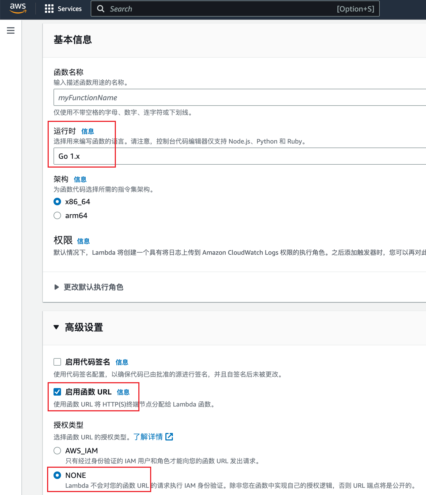

# Lambda Function for ChatGPT API
本项目是一个 AWS Lambda 函数，用于将 HTTP 请求转发到 OpenAI 的 ChatGPT API。本项目的代码使用 Go 语言编写。

## 用法
要部署此 Lambda 函数，可以直接下载编译好的部署包，或是参考以下步骤自行编译：

### 构建部署包
请确保您已经安装了 Go 编程语言和 GNU Make 工具。

首先，请克隆此存储库或下载源代码，然后使用以下命令构建部署包：
``` bash
make build
```
此命令将构建一个 Linux 二进制文件和一个 Zip 压缩文件。Zip 文件包含该二进制文件，可用于部署 Lambda 函数。

然后，您可以按照以下步骤部署 Lambda 函数：

### 创建 Lambda 函数
在 AWS 的 Lambda 函数控制台中，创建一个新的 Lambda 函数。选择运行时为 Go 1.x，勾选高级设置中的 "启用函数 URL" 选项，并根据需要选择授权类型。



接下来您可以通过 Lambda 函数控制台将部署包上传到 Lambda 函数中。

您也可以使用 AWS CLI 将部署包上传到 Lambda 函数中：

``` bash
make deploy
```

**请注意：Makefile 由 ChatGPT 编写，并未经过测试，在使用前请您务必检查Makefile。**

## 参考
[AWS Lambda 开发人员指南](https://docs.aws.amazon.com/lambda/latest/dg/welcome.html)

[AWS CLI 命令参考](https://docs.aws.amazon.com/cli/latest/reference/)

[OpenAI API 文档](https://beta.openai.com/docs/api-reference/introduction)

## 许可证
本项目是根据 MIT 许可证授权的开源软件。请参阅 LICENSE 文件以获取更多信息。

## 贡献
如果您想为该项目做出贡献，可以提出问题、提出新特性、提交错误报告或者创建一个 pull request。我们欢迎所有的贡献者。

## 作者
该项目由[Nangcr](https://github.com/nangcr)创建和维护。

## 致谢
感谢 OpenAI 团队提供优秀的 ChatGPT API，以及 AWS 团队提供稳定和可靠的 Lambda 和 API Gateway 服务。